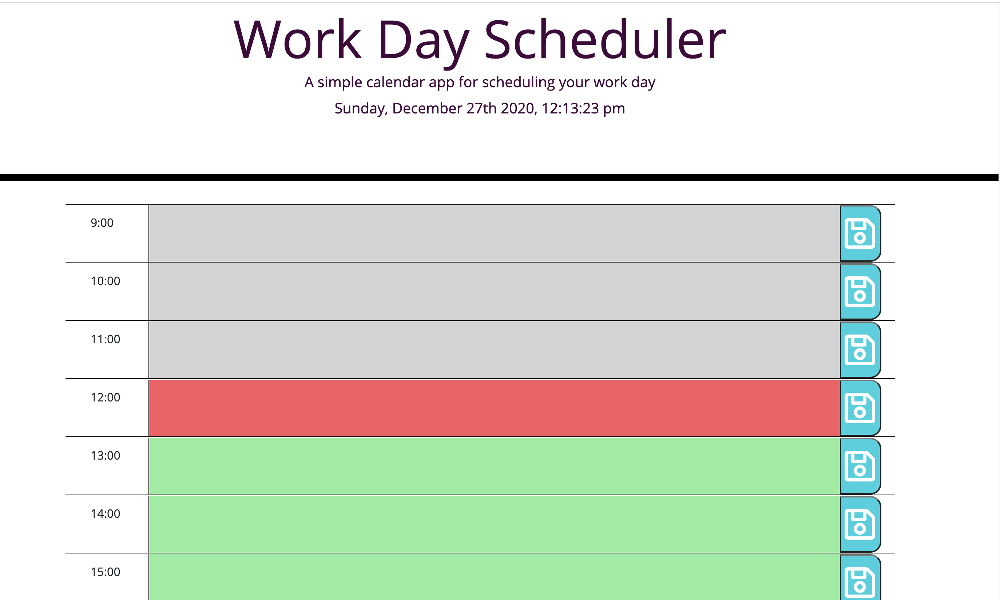

# Working-9to5
Day Calender to those who have a busy schedule. This page provide a page with current date and time to create schedule using time blocks align with work hours from 9:00-17:00. Past hours will turn grey while future ones are in mint colore and present hour is red. Schedule are saved until detete! Let's get bee-zzzz !

## Site Picture


# Table of Contents 
[Tittle](#Working-9to5)

[Site Picutre](#Site-picture)

[Table of Contents](#Table-of-Content)

[Description of Page Building ](#Description-of-Page-Building)

[Code Snippet](#Code-Snippet)

[Technologies Used](#Technologies-Used)

[Deployed Link](#Deployed-Link)

[Author](#Author)

[License](#License)


## Description of Page Building 
* Create a html file, a css file, and a javascript file
  
* In HTML file 
  <ul>
  <li>Set content in orgnize semantic HTML 
  <li>Create time blocks for hour 9:00-17:00 that have the hours, room for user input and save button 
  <li>Links pages and website and tool pages properly 
  </li>
  </ul>
    
* In Javascript file 
  <ul>
  <li>Name variables for different objects and function 
  <li>Set current date and time using Jquery 
  <li>Use on click function for save button to save user input in local storage 
  <li>Go throught the loops of objects by using the for loop to get the value and apply new hour 
  <li>Apply JSON.stringify funtion to add into storage and JSON.parse to get items to the page
  </li>
  </ul>
* In Style.Css file 
* <ul>
  <li>Style time blocks base on past hours, present hour, and future hours
  <li>Add style to save button with save icon and color  
  <li>Color headers and titles
  <li>Adjust texts, margin, and padding 
  </li>
  </ul>
## Code Snippet
Apply real live hour to the page 
```javascript
$('#currentDay').text(moment().format('dddd') + ", " + moment().format('MMMM Do YYYY, h:mm:ss a'));
```

Have all the events and functions in ready function to execute the code when the DOM is ready 
```javascript
$(document).ready(function(){
    if(!localStorage.getItem('plans')) {
      updatePlans(plans);
    } else {
      updatePlans(JSON.parse(localStorage.getItem('plans')));
    }
  })

```
Name contents using variables 
```javascript
var plans = {
    "9:00": "",
    "10:00": "",
    "11:00": "",
    "12:00": "",
    "13:00": "",
    "14:00": "",
    "15:00": "",
    "16:00": "",
    "17:00": "",
  };
```
Use addEventListener function to attaches on click event to button element
```javascript 
$("saveBtn").click(function() {
    value = $(this).siblings("textarea").val();
    hourvalue = $(this).siblings("div").text();
    saveSchedule(hourvalue, value);
  });
  ```
  Use conditional statement to compare the time and add class accordingly 
  ```javascript 
  if(timeNumber < presentHour) {
      $(textEntry).addClass("past");

    } else if (timeNumber > presentHour) {
      $(textEntry).addClass("future");
    } else {
      $(textEntry).addClass("present");
    }
  ```

## Technologies Used
- HTML - used to create elements on the DOM
  * [HTML](https://developer.mozilla.org/en-US/docs/Web/HTML)
- CSS - styles html elements on page
  * [CSS](https://developer.mozilla.org/en-US/docs/Web/CSS)
- Javascript - gives interacticve elements to web pages
  * [Javascript](https://developer.mozilla.org/en-US/docs/Web/JavaScript)
- Bootstrap - design and customize responsive site
  * [Bootstrap](https://getbootstrap.com/)
- Jquery - use API to makes DOM traversal, manipulation, event handling, etc. simpler
  * [Jquery](https://jquery.com/)
- Git - version control system to track changes to source code
   * [Git](https://git-scm.com/)
- GitHub - hosts repository that can be deployed to GitHub Pages
  * [Github](https://github.com/)


## Deployed Link

* [See Live Site](https://vubao2303.github.io/working-9to5/)


## Author

* **B Tram Vu** 

- [Link to Portfolio Site](https://github.com/vubao2303)
- [Link to Github](https://github.com/vubao2303/working-9to5)
- [Link to LinkedIn](https://www.linkedin.com/in/tram-vu-866250121/)

## License

© 2020 Trilogy Education Services, a 2U, Inc. brand. All Rights Reserved.


